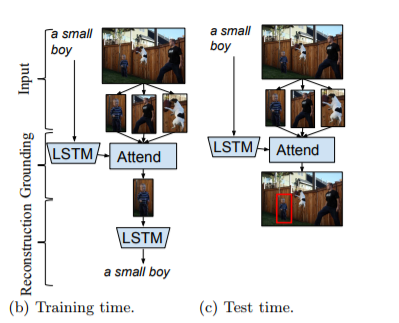

# Where am I?

This is an analysis of performances and overfitting of text grounding in images using deep learning. 
Some of the code are from [here](https://github.com/andrewliao11/Natural-Language-Object-Retrieval-tensorflow)

## The Task
Given an image and a query that refers to an object in the image, we want to find the bounding box of the object. 
We use [Referit dataset](http://tamaraberg.com/referitgame/) which contains a set of images and for each image a set of 
queries that refere to an object in that image. The data set contains the boundaries of the bounding box for each query.
We use Referit to build our on dataset where each data point contains a query and all the bounding boxes of its image.
The model needs to find the correct bounding box.

# The base
We use the supervised model discribed in [Grounding of Textual Phrases in Images by
Reconstruction](https://arxiv.org/pdf/1511.03745.pdf).  
Here's an image from the paper which illustrates the model: 

<ul>
<li>We use RNN to embed the query (LSTM)</li>
<li>We use CNN (VGG16) to embed each of bboxes</li>
<li>We use attention mechanism to get the score of each bbox, given the query, and the highest scored bbox is our winer! </li> 
</ul>

## Base on Steroids 

We also try the add the base model attention on the word level, that is, each time step attend on all the bboxes and by that we ground the words and not only tahe entire query.  
We also try to use bi-directional rnn since the relation between an object deccribed in time step t to other objects might be written in time steps smaller and/or higher than t. 

# Regularization

We examine state-of-the-art regularization techniques as [batch normalization](https://arxiv.org/abs/1502.03167), [dropout](https://arxiv.org/pdf/1207.0580.pdf), normal noise, L2 and gradient cliping. In additioin we porpuse a new technick that might shed some light on the model's performances useing reinforcment in an adversarial setting. 

## Player A

We add to our model another player, we call it A, while the base model is called B. 
While B's rnn process the query, at each time step B's output is the input of A's rnn (again, LSTM). A's rnn output is then projectes to two values, one for each of the two possible actions: 
1. Change the query's word (in time step t) to the word 'unk' and run B again with 'unk' as the input word instead of the original word - this will now be the B's output for time step t and get negative reward.
2. Do nothing and get zero reward.   
A  will take the action with the higer value and by that potentially making B's loss higher. 

### In more details

Before we start A, we start by running B on the original query (with no edits). This will give us B's loss and outputs (on the un-edited query). If A decides to edit a word it will get a reward equals to this loss divided by the number of words and multiplied by some negative number, this means that editing a word becomes less attractive as the un-edited loss gets bigger and/or the number of words gets smaller. 
Then we run B and A together. At the end of this run we get B's loss on the edited query and use it as the final reward. Using bellman equation, we calculate the value of each time step and the loss in time step t is the MSE between it and the A's value for the chosen action 
